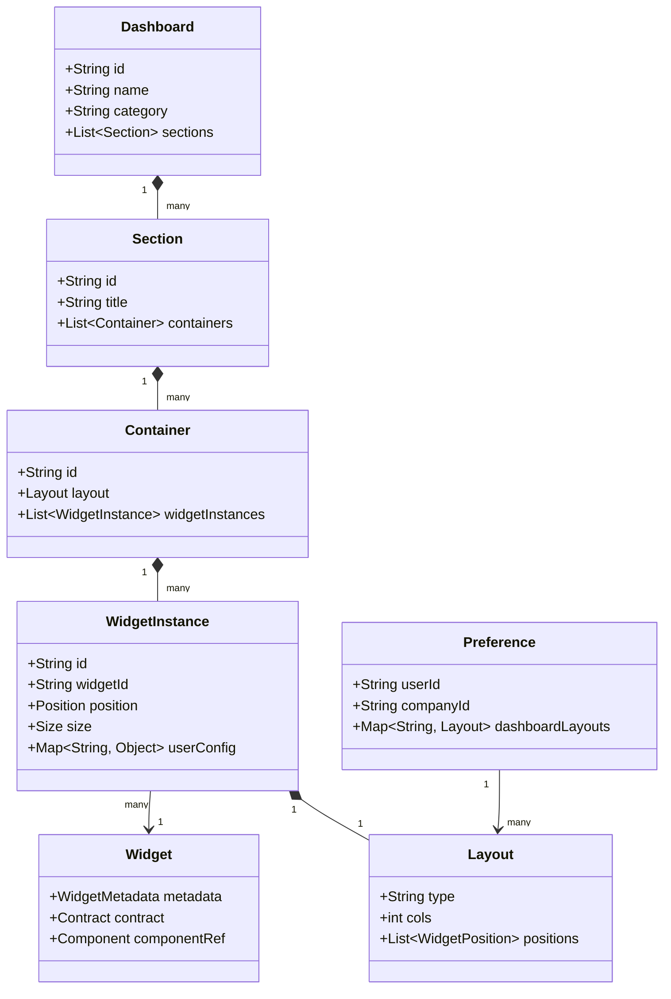
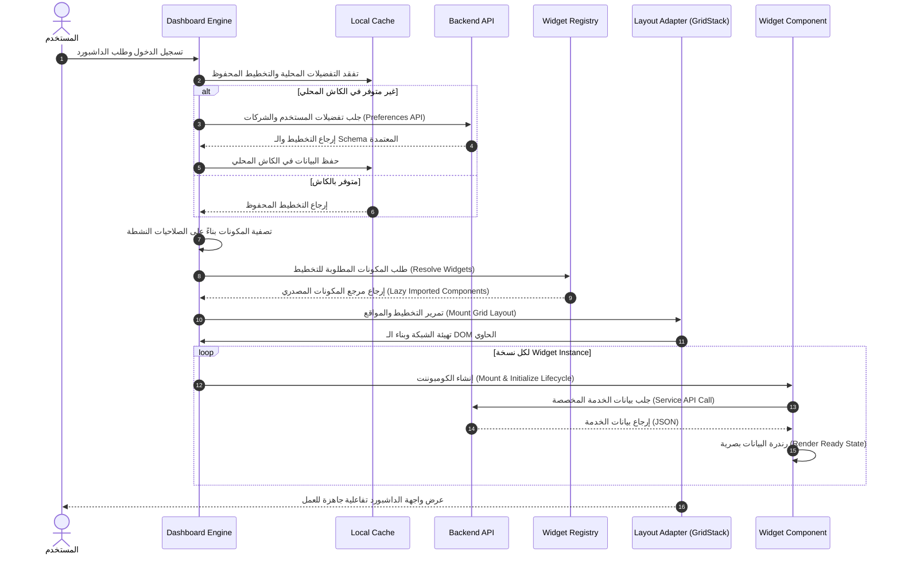
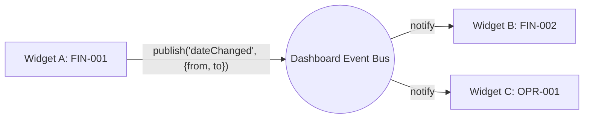
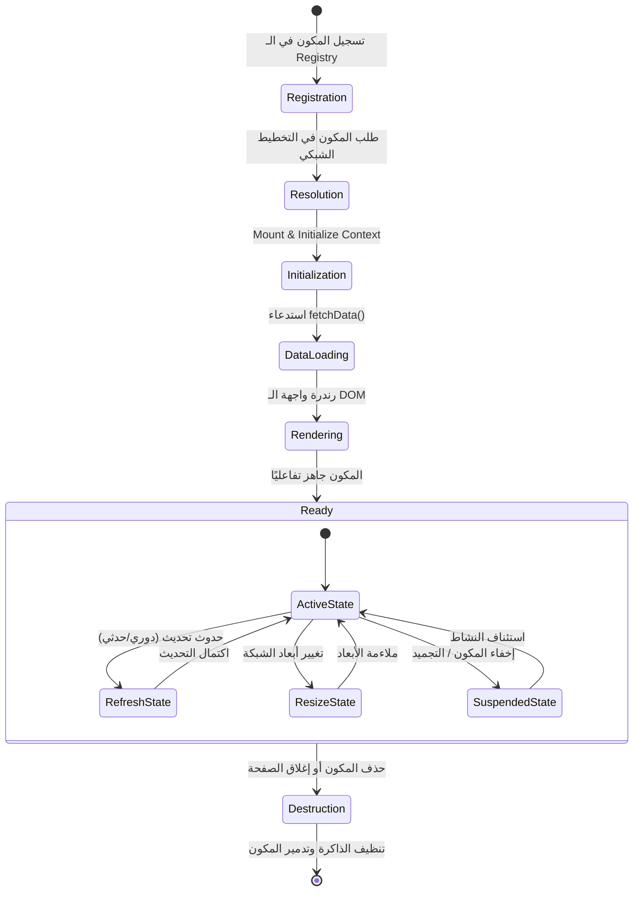
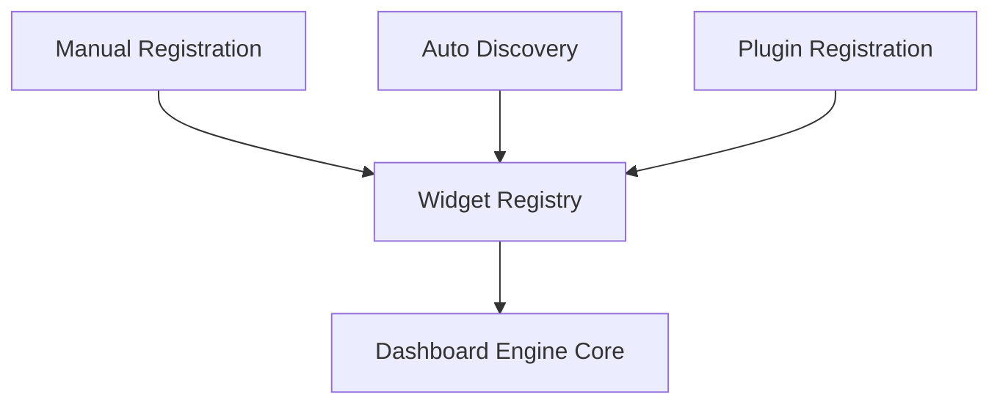
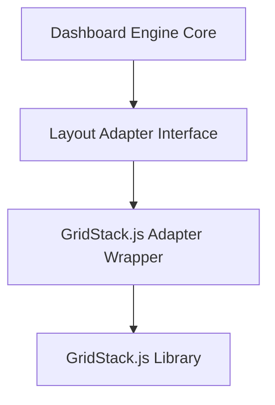

# 🏗️ دستور ومعمارية محرك لوحة التحكم (HWNix Dashboard Engine Architecture Constitution)
## المرجع الهندسي والتصميمي للتنفيذ والتشغيل طويل المدى

---

## 📌 1. الرؤية وأهداف التصميم (Vision & Design Goals)

### 1.1 الرؤية المعمارية (Vision)
تأسيس **إطار عمل داخلي كامل ومستقل (Internal Framework)** داخل منصة **HWNix ERP**، وليس مجرد صفحة أو لوحة تحكم واحدة. تم تصميم هذا المحرك ليكون النواة التشغيلية والبرمجية الحاكمة لبناء وتوصيل وتخصيص أي لوحة تحكم أو مكون عرض ([Widget](#glossary)) جاري أو مستقبلي في النظام، مع ضمان العزل التام بين منطق البيانات (Business Layer) ومنطق التخطيط البصري (Layout Engine).

### 1.2 أهداف التصميم (Design Goals)
* **استقلالية المكونات (Widget Decoupling):** الـ [Widgets](#glossary) لا تملك أي معرفة بالبيئة الخارجية المحيطة بها، ولا تعرف أين تقع في الشبكة البصرية، ولا كيفية سحبها أو إفلاتها.
* **جاهزية التوسع اللانهائي (Scale-Ready):** تصميم معزول يستوعب وجود مئات الـ [Widgets](#glossary) وعشرات لوحات التحكم المخصصة لمختلف المجالات والأقسام.
* **جاهزية بيئة SaaS متعددة المستأجرين والفروع:** عزل كامل للبيانات وتخصيصات الواجهة على مستوى الشركة (`company_id`) والفرع (`branch_id`) والمستخدم (`user_id`).
* **دعم إضافات الطرف الثالث (Plugins):** إتاحة تسجيل وإدراج [Widgets](#glossary) خارجية من موديولات أو إضافات يتم تثبيتها لاحقاً بالنظام دون الحاجة لتعديل الكود المصدري للمحرك.
* **جاهزية الذكاء الاصطناعي (AI-Ready):** بنية مرنة تستقبل [Widgets](#glossary) تفاعلية مدعومة بالذكاء الاصطناعي تقدم توصيات ذكية للمستخدم بناءً على موقعه ونشاطه.

---

## 🧩 2. المبادئ المعمارية (Architecture Principles)

تأسس تصميم محرك لوحة التحكم في HWNix على المبادئ الهندسية التالية التي توجه عمليات التطوير والصيانة:

* **الفصل الصارم للمسؤوليات (Separation of Concerns):** عزل طبقة العرض (UI Presentation) بالكامل عن منطق الأعمال (Business Logic) وتجريد محرك التخطيط الشبكي عن المكونات.
* **التركيب بدلاً من التكوين (Composition over Configuration):** بناء لوحة التحكم بتركيب عناصر صغيرة مستقلة وقابلة لإعادة الاستخدام هرمياً بدلاً من الاعتماد على تكوينات ضخمة ومعقدة لكل صفحة.
* **المسؤولية الواحدة (Single Responsibility):** لكل عنصر أو خدمة مسؤولية واحدة محددة بدقة (مثال: الـ [LayoutAdapter](#glossary) مسؤول فقط عن أبعاد الشبكة البصرية وإحداثياتها).
* **مبدأ المكون المفتوح/المغلق (Open/Closed Principle):** المحرك مغلق ضد التعديل البرمجي المباشر لنواته، ولكنه مفتوح للتوسيع ديناميكياً لإضافة أي لوحات تحكم أو [Widgets](#glossary) جديدة.
* **الأولوية للإضافات (Plugin-First):** تصميم المحرك بحيث تتم معاملة أي ويدجت جديدة كأنها إضافة خارجية تُحقن ديناميكياً، مما يضمن مرونة عالية عند إضافة ميزات جديدة لاحقاً.
* **الأولوية للخدمات والـ API (API-First):** التخاطب بين المحرك والواجهة الخلفية يتم حصرياً عبر واجهات برمجية موحدة وعقود واضحة (Contracts) تسهل التطوير المنفصل.
* **التشغيل الموجه بالأحداث (Event-Driven):** تتفاعل الـ [Widgets](#glossary) مع الفلاتر وبعضها البعض بطريقة مجهولة ومفككة بالكامل عبر بث واستقبال الأحداث ([Event Bus](#glossary)).
* **التحسين التدريجي (Progressive Enhancement):** تحميل وعرض الهياكل الأساسية فوراً، ثم جلب وتفعيل البيانات والتفاعلات تدريجياً لضمان سلاسة التصفح.
* **التوافق التام مع وضع عدم الاتصال (Offline Friendly):** تخزين التفضيلات والتخطيطات بصورة مؤقتة محلياً لضمان عدم توقف واجهة المستخدم عند انقطاع الاتصال المؤقت بالإنترنت.

---

## 📜 3. دستور المحرك (Dashboard Engine Constitution)
يمثل هذا القسم القوانين والمعايير المعمارية غير القابلة للكسر تحت أي ظرف من الظروف في المشروع:

1. **حظر الوصول المباشر لقاعدة البيانات:** يُمنع منعاً باتاً على أي جزء في واجهات لوحة التحكم أو الـ [Widgets](#glossary) الاستعلام المباشر من جداول قاعدة البيانات. تمر كافة استدعاءات جلب البيانات حصرياً عبر طبقة الخدمات التشغيلية (Service Layer).
2. **عزل محرك التخطيط البصري (Layout Abstraction):** لا يجوز بأي حال من الأحوال استدعاء مكتبة التخطيط الشبكي (مثل GridStack) من المكونات أو نماذج الواجهة. تُعزل المكتبة بالكامل خلف [LayoutAdapter](#glossary) مخصص.
3. **حماية مسار المراجعة المالية (FAC-001 Enforcement):** الأرقام والسيولة المعروضة باللوحات المالية يجب أن تكون متسقة 100% مع مخرجات الحركات المسجلة بدفتر الأستاذ المالي الموحد، ولا يجوز تعديل أي أرصدة أو حساب قيم خارج النواة المالية الحاكمة.
4. **عزل الأخطاء (Error Containment):** أي خطأ أو استثناء يحدث داخل [Widget](#glossary) معينة يجب احتواؤه بالكامل ضمن حيزها البصري (Error Boundary)، ويُمنع منعاً باتاً أن يتسبب خطأ مكون واحد في انهيار أو تجميد الصفحة بالكامل.

---

## 🚫 4. حدود مسؤوليات المحرك (What the Dashboard Engine Does NOT Do)

لمنع تضخم مسؤوليات المحرك وتداخل المهام البرمجية مستقبلاً، تم تحديد ما **ليس** من مسؤولياته بشكل قاطع:

* **لا يقرأ ولا يكتب في قاعدة البيانات مباشرة:** المحرك يتخاطب مع واجهات الـ API فقط، ولا يملك أي علم بجدول أو موديل بقاعدة البيانات.
* **لا يحتوي على منطق أعمال (No Business Logic):** المحرك لا يعلم كيف تُحسب الأرباح أو كيف يتم جرد المخازن، هو يوفر فقط الممرات لإيصال البيانات وعرضها.
* **لا يدير صلاحيات النظام:** المحرك لا يقرر صلاحية المستخدم الفردية للمهام؛ بل يمرر الصلاحيات المستلمة من نظام الصلاحيات المركزي ويطبقها وقائياً على رندرة الـ [Widgets](#glossary).
* **لا يتدخل في محتوى أو عرض الـ Widget:** المحرك لا يحدد نوع الخط أو تصميم الأرقام داخل الويدجت؛ بل يترك للمطور حرية التصميم والالتزام بالـ CSS الموحد طالما التزم المطور بالـ [Widget Contract](#glossary).
* **لا يقوم بالحسابات المالية أو الرياضية:** المحرك لا يحتسب المتبقي للفواتير ولا يجمع أرصدة الخزن؛ بل يستلمها جاهزة ومحسوبة من الخدمات التشغيلية بالباك إند.

---

## 🗂️ 5. نموذج الكيانات (Domain Model)

يوضح المخطط التالي العلاقات الهيكلية بين الكيانات الأساسية في نطاق عمل المحرك:



### 5.1 الكيانات التشغيلية:
* **Dashboard (اللوحة):** الكيان الأعلى الذي يمثل لوحة تحكم متكاملة مخصصة لدور أو قسم محدد (مثل لوحة تحكم المحاسب).
* **Section (القسم):** تقسيم أفقي أو هيكلي داخل اللوحة يفصل مساحات العمل بحدود بصرية واضحة.
* **Container (الحاوية):** مساحة تخطيطية معزولة داخل القسم تحتوي على شبكة رندرة مستقلة ومحاطة بالـ [LayoutAdapter](#glossary).
* **Widget (المكون الأساسي):** الكود والمكون المصدري المسجل في النظام الخاضع للـ Contract والـ SDK.
* **Widget Instance (نسخة المكون):** السجل الفعلي للمكون النشط على الشبكة، والذي يملك إحداثيات موقع فريدة (`x, y`) وأبعاداً محددة (`w, h`) وإعدادات مخصصة من قبل المستخدم.
* **Layout (التخطيط):** كائن يصف توزيع إحداثيات ومواقع المكونات داخل الشبكة.
* **Preference (التفضيلات):** إعدادات وخيارات المستخدم الفردية المنسقة للوحات التحكم.

---

## 🎨 6. معمارية تركيب الداشبورد (Dashboard Composition Architecture)

### 6.1 الهيكلية التركيبية (Composition Hierarchy)
تتشكل لوحة التحكم هرمياً لضمان المرونة العالية وتسهيل التحميل الكسول. يتم تركيب العناصر البصرية كما يوضح النموذج التالي:

```
┌───────────────────────────────────────────────────────────────┐
│                        Dashboard (App)                        │
├───────────────────────────────────────────────────────────────┤
│ ┌───────────────────────────────────────────────────────────┐ │
│ │                      Section (Financial)                  │ │
│ ├───────────────────────────────────────────────────────────┤ │
│ │ ┌───────────────────────────────────────────────────────┐ │ │
│ │ │                 Layout Container (Adapter)            │ │ │
│ │ ├───────────────────────────────────────────────────────┤ │ │
│ │ │  [WidgetInstance 1: FIN-001]   [WidgetInstance 2]      │ │ │
│ │ └───────────────────────────────────────────────────────┘ │ │
│ └───────────────────────────────────────────────────────────┘ │
└───────────────────────────────────────────────────────────────┘
```

### 6.2 دورة حياة التكوين (Composition Lifecycle)
1. **التهيئة (Initialize Composition):** يقوم المكون الحاكم للداشبورد بقراءة الـ Layout Schema.
2. **بناء الفروع (Mount Sections & Containers):** بناء وتدشين الأقسام والحاويات تدريجياً في الـ DOM.
3. **حقن الـ Adapter (Inject Layout Adapter):** تهيئة محيط التخطيط الشبكي لكل Container وعزله تماماً.
4. **رندرة النسخ (Resolve and Render Instances):** استدعاء الـ Registry لرندرة كل Widget Instance في موقعها المحدد ديناميكياً.

---

## 🧭 7. معمارية بيئة التشغيل (Runtime Architecture)

يوضح المخطط التالي دورة العمل الفعليّة للمحرك منذ لحظة دخول المستخدم وحتى اكتمال رندرة اللوحة:



---

## 🛠️ 8. حدود ومسؤوليات الخدمات (Service Boundaries & Responsibilities)

للحفاظ على عزل الطبقات، يمنع هذا الدستور تداخل الأدوار، ويوزع المسؤوليات على النحو التالي:

* **مكون العرض (View Component):** مسؤوليته تقتصر على بناء الواجهات وعرض البيانات المستلمة ومعالجة حالات التفاعل (Click, Hover) دون إجراء أي عمليات حسابية أو معالجة منطق أعمال.
* **Dashboard Engine Core:** إدارة تخطيط الصفحة، التحكم في الأحجام والمواقع، التنسيق بين الحاويات، فرض الصلاحيات وتدشين دورة حياة المكونات.
* **Layout Engine Adapter:** مسؤول حصرياً عن تهيئة السحب والإفلات وإحداثيات الشبكة وتغيير الحجم وإطلاق أحداث التحجيم وإعادة الهيكلة.
* **Widget Registry:** مخزن المكونات وعقد تسجيلها والتحقق من سلامة مواصفاتها وخصائصها الوصفية.
* **Backend Services:** معالجة البيانات، الحسابات المالية، حساب الأرصدة، توليد التلخيصات الإحصائية، وإرجاع استجابة JSON موحدة للفرونت إند.

---

## 📦 9. عقد المكونات وحزمة التطوير (Widget SDK & Widget Contracts)

كل [Widget](#glossary) في النظام يجب أن تمتثل لعقد برمجى ثابت (Contract Specification). يحدد الكود التالي واجهة التطوير (SDK Interface) للمكونات:

```typescript
/**
 * العقد المعماري الحاكم للويدجت (Widget Architecture Contract)
 */
export interface WidgetContract<TData = any, TConfig = any> {
  // معرف المكون المرجعي الفريد
  widgetId: string;
  
  // الخصائص الوصفية للمكون
  metadata: WidgetMetadata;

  // دالة التهيئة الأولية للمكون واستلام التكوين
  initialize(context: WidgetContext<TConfig>): void;

  // استدعاء جلب البيانات من طبقة الخدمات
  fetchData(): Promise<TData>;

  // رندرة الواجهة بناءً على البيانات المستلمة
  render(data: TData): void;

  // التعامل مع أحداث تغيير الأحجام والأبعاد للشبكة الحاوية
  onResize(newSize: GridSize): void;

  // استدعاء المكون عند تحويله للخلفية أو عدم رؤيته لتوفير الموارد
  onSuspend(): void;

  // تنظيف المكون عند الحذف أو التدمير
  onDestroy(): void;
}

export interface WidgetContext<TConfig> {
  companyId: string;
  branchId: string;
  config: TConfig;
  eventBus: WidgetEventBus;
  logger: ErrorLogger;
}
```

* **روابط مرجعية داخلية:** لمشاهدة تفاصيل مراحل حياة الويدجت وكيفية تطبيق هذا العقد تفصيلياً، راجع فصل [دورة حياة المكونات بالتفصيل](#11-دورة-حياة-المكونات-بالتفصيل-detailed-widget-lifecycle).

---

## 📜 10. خصائص البيانات الوصفية للمكونات (Widget Metadata Specification)

يجب أن توفر كل [Widget](#glossary) ملف بيانات وصفية (Metadata Schema) يتيح للمحرك إدارتها وتصفيتها والتحقق من صلاحياتها قبل الرندرة:

```json
{
  "$schema": "http://json-schema.org/draft-07/schema#",
  "title": "WidgetMetadata",
  "type": "OBJECT",
  "properties": {
    "id": { "type": "STRING" },
    "version": { "type": "STRING" },
    "category": { 
      "type": "STRING", 
      "enum": ["financial", "operational", "workflow", "monitoring", "communication", "administration", "security", "ai", "productivity", "personal"] 
    },
    "permissions": { 
      "type": "ARRAY", 
      "items": { "type": "STRING" } 
    },
    "supportedPackages": { 
      "type": "ARRAY", 
      "items": { "type": "STRING" } 
    },
    "supportedRoles": { 
      "type": "ARRAY", 
      "items": { "type": "STRING" } 
    },
    "defaultSize": {
      "type": "OBJECT",
      "properties": {
        "w": { "type": "INTEGER" },
        "h": { "type": "INTEGER" }
      },
      "required": ["w", "h"]
    },
    "minimumSize": {
      "type": "OBJECT",
      "properties": {
        "w": { "type": "INTEGER" },
        "h": { "type": "INTEGER" }
      },
      "required": ["w", "h"]
    },
    "maximumSize": {
      "type": "OBJECT",
      "properties": {
        "w": { "type": "INTEGER" },
        "h": { "type": "INTEGER" }
      },
      "required": ["w", "h"]
    },
    "refreshPolicy": {
      "type": "OBJECT",
      "properties": {
        "strategy": { "type": "STRING", "enum": ["manual", "polling", "live"] },
        "intervalSeconds": { "type": "INTEGER" }
      },
      "required": ["strategy"]
    },
    "cachePolicy": {
      "type": "OBJECT",
      "properties": {
        "ttlSeconds": { "type": "INTEGER" }
      },
      "required": ["ttlSeconds"]
    },
    "priority": { "type": "INTEGER", "minimum": 1, "maximum": 3 },
    "dependencies": {
      "type": "ARRAY",
      "items": { "type": "STRING" }
    },
    "featureFlags": {
      "type": "ARRAY",
      "items": { "type": "STRING" }
    }
  },
  "required": ["id", "version", "category", "permissions", "defaultSize", "minimumSize", "refreshPolicy", "cachePolicy", "priority"]
}
```

---

## 📡 11. معمارية تواصل المكونات (Widget Communication Architecture)

### 11.1 نظام النشر والاشتراك المجهول (Pub/Sub Event Bus)
يمنع هذا الدستور تماماً أي تواصل مباشر أو ربط ثنائي (Tight Coupling) بين الـ [Widgets](#glossary). التواصل يتم حصرياً عبر **قناة أحداث معزولة ومجهولة (Decoupled Event Bus)** يوفرها المحرك للمكونات عند إنشائها.



### 11.2 قواعد التخاطب المسموحة والمحظورة:
* **المسموح به:**
  * اشتراك الـ [Widgets](#glossary) في أحداث الفلاتر المشتركة للوحة التحكم (مثل تغيير الفرع، أو تغيير الفترة الزمنية).
  * قيام [Widget](#glossary) تشغيلية ببث حدث عند إتمام عملية (مثل قيام ويدجت التحصيل ببث حدث `paymentCollected`) لتقوم ويدجت السيولة بتحديث أرقامها تلقائياً.
* **المحظور تماماً:**
  * يُمنع على [Widget](#glossary) استدعاء دوال أو قراءة متغيرات حالة (State) لـ [Widget](#glossary) أخرى مباشرة.
  * يُمنع التخاطب المباشر عبر الـ DOM أو التلاعب بمكونات أخرى.
  * يُمنع إرسال كائنات ضخمة أو مراجع معقدة (Object References) في أحداث البث؛ يُسَمح فقط بتبادل هياكل بيانات بسيطة (Plain JSON/DTOs).

---

## 🔄 12. دورة حياة المكونات بالتفصيل (Detailed Widget Lifecycle)

يوضح المخطط التالي المراحل الزمنية المتعاقبة التي تمر بها الـ [Widget](#glossary) داخل المحرك:



1. **`Registration`:** تسجيل الكود المصدري للمكون والبيانات الوصفية في الـ `WidgetRegistry` عند إقلاع التطبيق (راجع فصل [استكشاف وتسجيل المكونات](#13-استكشاف-وتسجيل-المكونات-widget-discovery--registration)).
2. **`Resolution`:** تفحص المحرك للتخطيط ومطابقة الصلاحيات وجلب المكون المصدري بالتحميل الكسول.
3. **`Initialization`:** إنشاء نسخة المكون وحقن الـ `Context` والأحداث والخصائص.
4. **`Data Loading`:** بدء طلبات استعلام البيانات التشغيلية غير المتزامنة من طبقة الخدمات بالباك إند.
5. **`Rendering`:** رندرة البيانات بصرية بالـ DOM وإزالة مؤشرات العظام (Skeleton Loaders).
6. **`Refresh`:** إعادة استعلام ورندرة البيانات عند انتهاء الـ TTL أو نقر زر التحديث اليدوي.
7. **`Resize`:** إشعار المكون بتعديل مقاسات الحاوية لكي يقوم بملاءمة أبعاده البصرية والرسم البياني.
8. **`Visibility Change`:** التفاعل مع إخفاء المكون أو نقله لعلامة تبويب غير نشطة.
9. **`Suspension`:** تجميد عمليات الاستعلام والـ Polling للمكون عند إخفائه لتوفير أداء الذاكرة والشبكة.
10. **`Destruction`:** إلغاء الاشتراكات في الأحداث ومسح الكاش الموقت وتفكيك المكون بالكامل.

---

## 🔍 13. استكشاف وتسجيل المكونات (Widget Discovery & Registration)

يدعم المحرك 3 مسارات لتسجيل واستكشاف الـ [Widgets](#glossary) لضمان أقصى مرونة للتطوير:



* **التسجيل البرمجي (Manual Registration):** قيام المطور بتسجيل المكون يدوياً في ملف `widget-registry.js` التأسيسي للمشروع، وهو الأنسب للمكونات الأساسية للنظام.
* **الاستكشاف التلقائي (Auto Discovery):** فحص تلقائي لمجلد `src/modules/*/widgets/` واستيراد المكونات التي تمتلك ملف تعريف `widget.json` متوافق ديناميكياً عند بناء التطبيق (Vite Bundler Plugin).
* **تسجيل الإضافات (Plugin Registration):** واجهة برمجة مخصصة تمكن الإضافات والـ Plugins المثبتة من حقن وتسجيل الـ [Widgets](#glossary) الخاصة بها في الRegistry المركزي لحظة إقلاع التطبيق عبر الـ API.

---

## 🚀 14. استراتيجية رندرة الداشبورد (Dashboard Rendering Strategy)

يلتزم المحرك باستراتيجيات رندرة ذكية تضمن الحفاظ على سرعة واستقرار استجابة الصفحة:

### 14.1 التحميل الكسول المتوازي (Parallel Lazy Loading)
يتم تحميل الهيكل العام للحاويات والأقسام فوراً. بعد ذلك، يقوم المحرك ببدء طلب المكونات بالتحميل الكسول (`dynamic imports`) بشكل متوازي مقسم بناءً على الأولوية (`priority`):
* مكونات الأولوية 1 (الـ KPIs العلوية) تُستدعى وتُرندر أولاً.
* مكونات الأولوية 2 و 3 تؤجل رندرتها حتى اكتمال رندرة مكونات الأولوية الأولى واستقرار الصفحة.

### 14.2 احتواء الفشل والبطء (Failed & Slow Widgets Containment)
* **المكونات الفاشلة (Failed Widgets):** في حال فشل استعلام ويدجت معينة أو حدوث خطأ برمجي، تقوم الـ `Error Boundary` الحاوية لها بعرض صندوق خطأ رمزي مبسط للمستخدم مع خيار إعادة المحاولة، مع السماح لبقية الـ [Widgets](#glossary) بالصفحة بالعمل بكفاءة تامة.
* **المكونات البطيئة (Slow Widgets):** يتم وضع مهلة زمنية قصوى لجلب بيانات الويدجت (مثال: 10 ثوانٍ)، عند تجاوزها يتم إلغاء طلب الـ API تلقائياً وعرض تنبيه "تجاوز وقت الاستجابة" لكي لا تتجمد واجهة المستخدم.
* **المكونات غير المرئية (Hidden Widgets):** لا يتم تحميل بيانات المكونات التي تقع في حاويات مطوية (Collapsed) أو علامات تبويب غير نشطة إلا عند قيام المستخدم بفتحها وتفعيل ظهورها (Lazy Fetching).

---

## 💾 15. معمارية إدارة الحالة (State Management Architecture)

يُقسم نظام إدارة الحالة داخل المحرك إلى 3 مستويات معزولة لضمان عدم حدوث تداخل:

* **حالة المحرك (Engine State):** حالة لوحة التحكم ككل (مثل وضع التصميم النشط `designMode` أو العادي، التخطيط الجاري، وقائمة الحزم المتاحة). تدار مركزياً في الـ Engine State Manager.
* **الحالة المشتركة للوحة (Dashboard Shared State):** قيم الفلاتر المشتركة للشركة والفرع والفترة الزمنية المفتوحة.
* **الحالة المحلية للمكون (Widget Local State):** البيانات الجافة الخاصة بالويدجت وأكواد الرسم البياني وحالة الأخطاء والتحميل الخاصة بها، ويُمنع تسريبها خارج نطاق المكون.

---

## 🔌 16. معمارية محرك التخطيط وعزل الأدوات (Layout Engine Architecture / Layout Adapter)

### 16.1 نمط التصميم المعتمد (Adapter Pattern)
[Layout Engine](#glossary) مبني بالكامل على GridStack كمحرك للتخطيط، ولكنه معزول خلف واجهة تجريدية مخصصة (`LayoutAdapter`).
* المكونات لا تستدعي GridStack ولا تعرف عنه شيئاً.
* يتم التعامل مع الشبكة البصرية فقط عبر المحول البرمجي الموحد لضمان التجريد التام (راجع سجل القرارات الهندسية [ADR-001](#1-adr-001-عزل-مكتبة-التخطيط-البصري-بالكامل-layout-abstraction)).



---

## 🗄️ 17. معمارية السجلات المركزية (Registry Architecture)

* **Widget Registry:**
  * يسجل ديناميكياً المكونات المتاحة وقائمة الـ Metadata.
  * يحلل المكون ويتحقق من استيفائه للعقود.
* **Dashboard Registry:**
  * يدير لوحات التحكم المحددة وباقاتها الافتراضية وحالات الترخيص.

---

## 📝 18. معيار إعدادات الداشبورد (Dashboard Configuration Schema)

يحدد مخطط JSON التالي البنية الثابتة لحفظ واسترجاع لوحة التحكم وإعدادات تخطيط المكونات:

```json
{
  "$schema": "http://json-schema.org/draft-07/schema#",
  "title": "DashboardConfigurationSchema",
  "type": "OBJECT",
  "properties": {
    "dashboardId": { "type": "STRING" },
    "companyId": { "type": "STRING" },
    "branchId": { "type": "STRING" },
    "version": { "type": "STRING" },
    "sections": {
      "type": "ARRAY",
      "items": {
        "type": "OBJECT",
        "properties": {
          "id": { "type": "STRING" },
          "title": { "type": "STRING" },
          "order": { "type": "INTEGER" },
          "containers": {
            "type": "ARRAY",
            "items": {
              "type": "OBJECT",
              "properties": {
                "id": { "type": "STRING" },
                "gridColumns": { "type": "INTEGER", "default": 12 },
                "widgetInstances": {
                  "type": "ARRAY",
                  "items": {
                    "type": "OBJECT",
                    "properties": {
                      "id": { "type": "STRING" },
                      "widgetId": { "type": "STRING" },
                      "x": { "type": "INTEGER" },
                      "y": { "type": "INTEGER" },
                      "w": { "type": "INTEGER" },
                      "h": { "type": "INTEGER" },
                      "userConfig": { "type": "OBJECT" }
                    },
                    "required": ["id", "widgetId", "x", "y", "w", "h"]
                  }
                }
              },
              "required": ["id", "widgetInstances"]
            }
          }
        },
        "required": ["id", "title", "containers"]
      }
    }
  },
  "required": ["dashboardId", "companyId", "version", "sections"]
}
```

---

## 📦 19. باقات الداشبورد الجاهزة (Dashboard Packages)

يدعم المحرك [Dashboard Packages](#glossary) افتراضية جاهزة للتحميل الفوري للمؤسسات المستأجرة بناءً على أدوار المستخدمين التشغيلية:
* **Owner Dashboard Package:** لملاك الشركات والمديرين المباشرين.
* **Accountant Dashboard Package:** للمحاسبين الماليين.
* **Warehouse Dashboard Package:** لأمناء المخازن.
* **Sales & Collections Dashboard Package:** لفريق المبيعات والتحصيل والأقساط.

---

## 💾 20. التخصيص وحفظ التخطيط (Personalization & Layout Persistence)

* **الحفظ الفوري للتخطيط البصري:** يتم حفظ الإحداثيات عند التحريك فوراً في الكاش المحلي للمتصفح.
* **المزامنة الخلفية:** Debounced Autosave يرسل التحديثات للسيرفر في الخلفية بشكل متفرق لمنع إغراق الشبكة بالطلبات المتكررة.

---

## 📡 21. عقود الـ API الخلفية (Backend API Contracts)

* **GET /api/v1/dashboard/preferences?dashboard_id={id}:** لجلب تفضيلات المستخدم والتخطيط.
* **POST /api/v1/dashboard/preferences:** لحفظ وتحديث التخطيط بالكامل.

---

## 🎨 22. فلسفة التجاوب والتخطيط التلقائي (Responsive & Auto Layout Philosophy)

* **Auto-Packing:** سحب المكونات للأعلى تلقائياً وسد الفراغات الناتجة عن تغيير حجم أو إزالة [Widgets](#glossary).
* **تخفيض الأعمدة:** التحول التلقائي من تخطيط 12 عموداً للشاشات المكتبية إلى تخطيط أحادي العمود للشاشات المحمولة.

---

## ⚡ 23. استراتيجية وميزانية الأداء (Performance Strategy & Budget)

* حجم أكواد الCore للمحرك لا تتجاوز **50 كيلوبايت** عند الضغط.
* التحميل الأولي لا يتجاوز **1.5 ثانية**.
* كاش السيرفر والتخزين المؤقت للبيانات التشغيلية لمنع إرهاق قواعد البيانات.

---

## 🔐 24. الأمان ونموذج الصلاحيات (Security & Permission Model)

* التحقق المزدوج من الصلاحيات (فرونت إند لمنع رندرة المكون، وباك إند لمنع إرجاع بيانات الـ API).
* العزل التام للمستأجرين والفروع بناءً على معايير الـ SaaS و `company_id`.

---

## 🚨 25. معالجة الأخطاء والتعافي (Error Handling & Recovery)

* الالتزام بـ `DashboardErrorBoundary` لتطويق أخطاء الويدجت محلياً (راجع فصل [استراتيجية رندرة الداشبورد](#142-احتواء-الفشل-والبطء-failed--slow-widgets-containment)).
* دعم آلية المحاولات المتكررة الذكية (Exponential Backoff) عند انقطاع الاتصال بالشبكة.

---

## 📊 26. الصفات غير الوظيفية للجودة (Quality Attributes)

صُمِمَ المحرك لضمان تحقيق المعايير الهندسية والصفات غير الوظيفية التالية بكفاءة:

* **القابلية للتوسع (Scalability):** تتم رندرة الـ [Widgets](#glossary) بالتحميل الكسول المتوازي، مما يضمن ثبات أداء النظام حتى لو أضفنا مئات الـ [Widgets](#glossary) واللوحات.
* **القابلية للتمدد (Extensibility):** بفضل واجهة الـ `WidgetRegistry` التفاعلية، يمكن لأي موديول أو Plugin خارجي حقن [Widgets](#glossary) جديدة دون تعديل الأكواد التأسيسية للمحرك.
* **سهولة الصيانة (Maintainability):** يؤدي عزل محرك التخطيط الشبكي خلف الـ [LayoutAdapter](#glossary) إلى إمكانية استبدال كود التخطيط بالكامل مستقبلاً دون المساس بالأكواد البرمجية للـ [Widgets](#glossary).
* **قابليّة الاختبار (Testability):** العقود الموحدة للـ [Widgets](#glossary) وتجريد الأحداث يسهلان كتابة اختبارات معزولة لكل مكون ومحاكاة المدخلات والمخرجات.
* **الاعتمادية والاستقرار (Reliability):** بفضل حدود الأخطاء المعزولة (`ErrorBoundary`)، لا يتسبب تعطل مكون مبيعات واحد في توقف لوحة تحكم المحاسب بالكامل.
* **القابلية للمراقبة (Observability):** يقوم المحرك بتمرير الـ `logger` في سياق التهيئة لكل مكون لتوثيق وتتبع الأخطاء البرمجية لحظياً وإرسالها للسيرفر.

---

## ⚡ 27. المخاطر والتحديات التشغيلية (Risks & Future Challenges)

يوضح الجدول التالي التحديات التقنية المستقبلية المتوقعة وكيف صممنا المحرك وقائياً لتفاديها:

| الخطر المتوقع | تأثيره التقني | الحل الوقائي المصمم بالمحرك |
| :--- | :--- | :--- |
| **تضخم عدد الـ Widgets** | زيادة حجم الـ Bundle وبطء تحميل الصفحة. | تفعيل التحميل الكسول المتوازي لملفات الـ Widgets وعدم استدعائها إلا عند الحاجة الفعليّة للرندرة. |
| **تضخم واختناق الـ Event Bus** | حدوث تكرار وتداخل واسترجاعات دائرية للأحداث. | منع البث المفتوح وفرض قيود صارمة على تبادل البيانات، وحظر تبادل المراجع المعقدة للأوبجكتس. |
| **تعارض وتداخل الـ Plugins** | كسر التنسيقات البصرية والـ CSS للمكونات. | تطبيق حماية وفصل الأسماء (CSS Namespacing) وعزل بيئة الـ DOM لكل Container مستقل. |
| **تغير إحداثيات ومواصفات التخطيط** | تلف وتخريب التفضيلات القديمة للمستخدمين. | تطبيق سياسة تتبع إصدار المخطط وقواعد الترقية وتصحيح التخطيط التلقائي (Backward Compatibility). |

---

## 🔄 28. قواعد الترقية والتوافقية الخلفية (Upgrade & Migration Rules)

لحماية تفضيلات وتخطيطات المستخدمين القديمة من التلف عند حدوث ترقيات أو تحديثات برمجية للنظام، يتبع المحرك القواعد الصارمة التالية:

* **تتبع إصدارات التخطيط (Schema Versioning):** يتم حفظ رقم إصدار المخطط الشبكي مع التفضيلات. عند تحميل اللوحة، يتفحص النظام ما إذا كان هناك إصدار أحدث للـ Layout Package ليقوم بدمج التعديلات بأمان.
* **آلية المعالجة عند الحذف أو التعديل للمكونات (Fallback Rules):**
  * **عند حذف ويدجت نهائياً:** إذا وجد المحرك في تفضيلات المستخدم معرف ويدجت تم حذفه من الـ Registry، يقوم تلقائياً بإسقاطه من التخطيط بشكل صامت دون إطلاق أخطاء.
  * **عند تعديل الحجم الافتراضي للويدجت:** إذا تعارض الحجم المخزن بتفضيلات المستخدم مع الحد الأدنى أو الأقصى الجديد للويدجت بعد تعديل كودها، يقوم المحرك تلقائياً بضبط الأبعاد لتلائم القيود الجديدة وتصحيح التخطيط وحفظه.

---

## 👨‍💻 29. تجربة المطور (Developer Experience - DX)

تم تصميم المحرك لتبسيط وتوحيد خطوات إضافة أي Widget جديدة مستقبلاً. يوضح الدليل التالي الخطوات المبسطة للمطور:

### سيناريو تشغيلي: مطور يريد إضافة ويدجت "إجمالي المبيعات الرقمية" اليوم:
1. **الخطوة 1: إنشاء مجلد المكون:**
   * ينشئ المطور مجلداً باسم المكون في موديول التقارير: `src/modules/reports/widgets/DigitalSales/`.
2. **الخطوة 2: صياغة ملف المكون والعقد:**
   * يكتب المطور كود الواجهة البصرية `index.vue` ملتزماً بـ `WidgetContract` ومستدعياً للبيانات من `StatisticsService`.
3. **الخطوة 3: صياغة ملف البيانات الوصفية:**
   * يكتب المطور ملف `metadata.json` لتحديد المعرف `reports.digital-sales` والصلاحيات والحجم الافتراضي (مثل `w: 4, h: 2`).
4. **الخطوة 4: التسجيل التلقائي والظهور:**
   * يقوم المحرك تلقائياً عبر الـ Auto Discovery بالتقاط المكون الجديد، وتسجيله بالـ Registry، وعرضه للمدراء في قائمة "تخصيص اللوحة" فوراً.

---

## 🧪 30. استراتيجية الاختبارات (Testing Strategy)

لضمان عمل المحرك بكفاءة تامة وتجنب أي تراجع برمجى (Regression) أثناء الصيانة، تخضع مكوناته لاختبارات صارمة:

* **اختبارات الوحدة (Unit Testing):**
  * اختبار كود الـ `LayoutAdapter` للتحقق من سلامة تهيئة الشبكة، تفعيل وتعطيل وضع التصميم، وقراءة التخطيط الشبكي بصيغة متوافقة مع الـ Configuration Schema.
  * تفحص صحة التحقق من الصلاحيات والـ Metadata بالـ `WidgetRegistry`.
* **اختبارات التكامل (Integration Testing):**
  * اختبار مسار الرندرة بالكامل (Rendering Pipeline) والتأكد من تتابع تحميل المكونات بناءً على الأولوية.
  * اختبار تواصل المكونات والتأكد من إطلاق واستقبال الأحداث عبر الـ [Event Bus](#glossary) بشكل مستقل وصحيح.
  * اختبار محاكاة الأخطاء للتحقق من احتواء الـ Error Boundaries للتعطلات بنجاح.

---

## 🏁 31. خطة الانتقال والهجرة (Migration Strategy)

يتم الانتقال من شاشة الداشبورد القديمة الحالية إلى نظام الـ Dashboard Engine الجديد تدريجياً لضمان عدم حدوث ارتباك بالخدمة:

* **المرحلة 1: بناء وتدشين النواة (Engine Infrastructure):**
  * كتابة كود الـ Core Dashboard Engine والمحولات (Adapters) والسجلات (Registries) بمعزل تام ودون تداخل مع الصفحات الحالية.
* **المرحلة 2: إتاحة اللوحة التجريبية (Sandbox/Pilot Testing):**
  * تهيئة مسار لوحة تجريبية مستقلة (مثال: `/app/admin/dashboard-v2`) مخصصة للمطورين والمختبرين لتجريب المكونات والتخطيط وحفظ التفضيلات ومراقبة الأداء.
* **المرحلة 3: النقل التدريجي للمكونات (Incremental Migration):**
  * تحويل المكونات القديمة واحداً تلو الآخر لتتوافق مع الـ Widget Contract والـ SDK وتفويض استعلام البيانات لطبقة الخدمات.
* **المرحلة 4: الإحلال النهائي (Full Replacement):**
  * تحويل المسار الرسمي `/app/admin/dashboard` ليشير للمحرك الجديد، وأرشفة الأكواد القديمة بالكامل بعد التأكد من استقرار الخدمة.

---

## 📁 32. هيكل المجلدات المقترح (Folder Structure)

يلتزم المشروع بهيكل المجلدات الموضح للتأكيد على عزل محرك لوحة التحكم ووضعه ضمن الـ Core Framework للتطبيق:

```
src/
├── @core/
│   └── dashboard/
│       ├── adapters/
│       │   ├── LayoutAdapter.js       # محول التخطيط العام
│       │   └── GridStackAdapter.js    # تغليف وتجسيد GridStack
│       ├── contracts/
│       │   └── WidgetContract.ts      # العقود والأنماط الموحدة
│       ├── components/
│       │   ├── DashboardEngine.vue    # المكون الحاكم للرندرة واللوحة
│       │   ├── DashboardContainer.vue # حاوية الشبكة المستقلة
│       │   └── ErrorBoundary.vue      # احتواء أخطاء المكونات
│       ├── store/
│       │   └── dashboardStore.js      # إدارة حالة المحرك وفلاتره المشتركة
│       ├── eventbus/
│       │   └── EventBus.js            # قناة التخاطب بين المكونات
│       └── registry/
│           ├── WidgetRegistry.js      # سجل المكونات والتحقق منها
│           └── DashboardRegistry.js   # سجل اللوحات والباقات المتاحة
```

---

## 📓 33. قاموس المصطلحات المعمارية (Glossary)

* <a id="glossary"></a>**Dashboard (اللوحة):** الواجهة العليا التي تحتوي على الأقسام وتجمع المكونات المخصصة لدور وظيفي معين.
* **Workspace (مساحة العمل):** كامل بيئة الداشبورد تفاعلياً والمحملة بالصلاحيات والتفضيلات النشطة للمستخدم.
* **Section (القسم):** تقسيم هيكلي وتنظيمي أفقي داخل لوحة التحكم لفصل مساحات العمل.
* **Container (الحاوية):** المربع الحاضن لشبكة رندرة المكونات والمخفي خلف الـ Layout Adapter.
* **Widget (الويدجت):** مكون العرض الأساسي المستقل الذي يعرض البيانات وممتثل لـ `WidgetContract`.
* **Widget Instance (نسخة الويدجت):** التمثيل الفعلي للويدجت على لوحة التحكم ممتلئاً بإحداثيات الموقع والحجم وإعدادات التخصيص.
* **Registry (السجل):** المكون البرمجي المسؤول عن فهرسة وتدقيق وحفظ مراجع المكونات ولوحات التحكم.
* **LayoutAdapter (المحول):** الطبقة البرمجية التي تقوم بتغليف وتجريد مكتبة التخطيط الشبكي.
* **Dashboard Package (الباقة الجاهزة):** مجموعة من لوحات التحكم والـ Widgets المجهزة مسبقاً وتُسند للمستأجرين الجدد بناءً على الأدوار.
* **Layout (التخطيط):** كائن البيانات الوصفي الذي يحدد إحداثيات ومواقع كل Widget Instance على الشبكة.
* **Composition (التركيب):** الهيكلية والتركيبة الهرمية لعناصر لوحة التحكم الجاري رندرتها.
* **Runtime (بيئة التشغيل):** دورة ومسار معالجة المحرك للمكونات من لحظة الدخول وحتى تفاعل المستخدم.
* **Schema (المخطط):** البنية البيانية JSON الموحدة والمعتمدة لحفظ التخطيط والإعدادات.
* **Event Bus (قناة الأحداث):** القناة البرمجية المركزية لتنفيذ نمط النشر والاشتراك لتخاطب المكونات بصورة مجهولة ومفككة كلياً.
* **Feature Flag (أعلام الميزات):** خيارات التحكم الديناميكي لتمكين أو تعطيل رندرة الويدجت للمستأجرين.
* **Metadata (البيانات الوصفية):** تفاصيل الخصائص والصلاحيات والحجم الخاص بالويدجت والمحفوظة في ملف JSON.
* **SDK (حزمة التطوير):** الواجهات البرمجية والعقود التأسيسية المتاحة للمطورين لبناء ويدجتس متوافقة.
* **ADR (سجل القرار الهندسي):** وثيقة توثق القرارات المعمارية المتخذة لتصميم النظام ومبرراتها التقنية.

---

## 📝 34. سجلات القرارات الهندسية (Architecture Decision Records - ADR)

يوثق هذا القسم القرارات الهندسية المحورية التي تم اتخاذها لتأسيس المحرك والأسباب الكامنة وراء اختيارها:

### 📑 ADR-001: عزل مكتبة التخطيط البصري بالكامل (Layout Abstraction)
* **القرار المعماري:** عزل واستبدال مكتبة GridStack.js بالكامل خلف محول `LayoutAdapter` برمجى مخصص، ومنع أي تواصل مباشر بين المكونات والمكتبة.
* **المشكلة المسببة:** كود الداشبورد القديم كان يرتبط ارتباطاً وثيقاً مع واجهات DOM وتنسيقات GridStack. عند تحديث مكتبة GridStack أو الرغبة في استبدالها بمحرك آخر (مثل Vue-Grid-Layout أو CSS Grid عادي)، كان يتطلب ذلك إعادة كتابة كامل أكواد المكونات وتعديلها.
* **البدائل المرفوضة:** 
  * *البديل:* استدعاء GridStack مباشرة داخل المكونات لتسريع الإنتاج.
  * *سبب الرفض:* يؤدي لـ Coupling فادح ويمنع صيانة النظام أو ترقية وتغيير محرك التخطيط في المستقبل بسهولة.
* **الموازنات والقيود (Trade-offs):** إضافة طبقة وسيطة طفيفة تطلب كتابة كود المحول، ولكن الفائدة طويلة المدى في قابلية الصيانة وتفادي الـ Lock-in تفوق هذه التكلفة بكثير.

### 📑 ADR-002: الاعتماد المطلق على طبقة الخدمات لبيانات الـ Widgets
* **القرار المعماري:** حظر استدعاء الموديلات أو الجداول المالية والتشغيلية في فرونت إند لوحة التحكم، وتوجيه كافة العمليات للاعتماد على الـ Services بالباك إند.
* **المشكلة المسببة:** خطر عدم اتساق البيانات المالية وفروقات الأرصدة الناتجة عن تشتت طرق الحساب البرمجية بين الواجهة الخلفية والأمامية وقاعدة البيانات.
* **البدائل المرفوضة:** 
  * *البديل:* تمكين المطورين من استعلام وتصفية الجداول تفاعلياً من الـ Controllers لسهولة التطوير.
  * *سبب الرفض:* يتعارض بالكامل مع معايير ومبادئ السلامة المالية ودستور `FAC-001`.
* **المعلومات التاريخية والتأثير:** يضمن بقاء الداشبورد كطبقة عرض وتشغيل آمنة ومعزولة كلياً عن منطق احتساب الأثر المالي والتشغيلي المحفوظ بنواة النظام.

### 📑 ADR-003: استخدام السجل المركزي المفتوح (Dynamic Widget Registry)
* **القرار المعماري:** بناء سجل مركزي `WidgetRegistry` يسجل ديناميكياً المكونات ويتأكد من مواصفات الـ Metadata وتوافقها مع الـ JSON Schema.
* **المشكلة المسببة:** الرغبة في التوسع الفائق ودعم إدراج ويدجتس خارجية من إضافات (Plugins) مستقلة دون المساس بنواة الداشبورد الأساسية.
* **البدائل المرفوضة:**
  * *البديل:* كتابة واستدعاء كود المكونات ساكناً (Hardcoded Import) في صفحة الداشبورد الرئيسية.
  * *سبب الرفض:* يقتل قابلية التوسع ويمنع كلياً إمكانية إضافة ميزات أو تخصيصات مرنة للمستأجرين والسوفت وير كخدمة (SaaS).
* **المعلومات التاريخية والتأثير:** يتيح للمطورين مستقبلاً إضافة وتطوير أي موديول خارجي وحقن الويدجتس الخاصة به ديناميكياً بسهولة وأمان تام.
