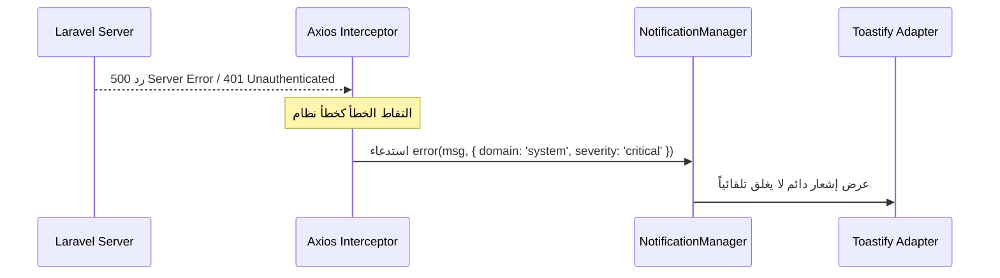
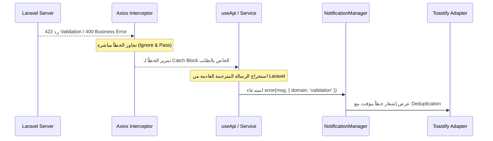

# 🛡️ مستند التصميم المعماري لنظام الإشعارات والتحقق (Notification Architecture Design)

يوضح هذا المستند المعمارية النهائية والمستقرة لـ **طبقة الإشعارات والتحقق (Notification Layer)** في مشروع **HWNix ERP**. الهدف هو تجريد الإشعارات تماماً وتحويلها إلى خدمة مستقلة تفصل بين "إنتاج الرسالة/الحدث" و"كيفية عرضها"، مما يسمح للنظام بالتوسع والاستمرار لسنوات دون الحاجة لإعادة تصميم أو كسر الشاشات.

---

## 🏛️ 1. الهيكل النهائي للنظام (System Architecture)

يتم تجريد مكتبة العرض الفعلي (`vue3-toastify` أو غيرها) خلف واجهة موحدة (**Facade**) تسمى `NotificationManager` (أو Composable موازٍ `useAppNotifications`).
* **لا تعرف** أي أجزاء أخرى من الكود (مكونات، composables، خدمات) أي شيء عن مكتبة `vue3-toastify` ولا تقوم باستيرادها.
* يتم تحويل الإشعارات من منطق **UI-Driven** (اعرض Toast نجاح) إلى منطق **Event-Driven / Facade-Driven** (حدثت هذه العملية، والـ Manager هو من يقرر هل يعرض Toast، Dialog، Banner، أو يرسل ويب سوكت).

```
   ┌─────────────────────────────────────────────────────────────┐
   │                  Business Logic / UI Layer                  │
   │  (Components, useApi Composable, Services, Echo Listeners)  │
   └──────────────────────────────┬──────────────────────────────┘
                                  │ (استدعاء غير مباشر عبر الواجهة)
                                  ▼
   ┌─────────────────────────────────────────────────────────────┐
   │             Facade: NotificationManager (Service)           │
   │  - Queueing    - Deduplication    - Severity & Scopes       │
   │  - Priority    - History Log      - Dynamic Loading         │
   └──────────────────────────────┬──────────────────────────────┘
                                  │ (توجيه الإشعارات للأدوات المناسبة)
                                  ▼
   ┌─────────────────────────────────────────────────────────────┐
   │                     Rendering Adapters                      │
   │   ┌───────────────┐  ┌───────────────┐  ┌───────────────┐   │
   │   │  Toastify     │  │  Vuetify      │  │  Future API   │   │
   │   │  Adapter      │  │  Dialogs      │  │  (Push/WS)    │   │
   │   └───────────────┘  └───────────────┘  └───────────────┘   │
   └─────────────────────────────────────────────────────────────┘
```

---

## 🛡️ 2. مسؤوليات الطبقات بشكل صارم (Layer Responsibilities)

لضمان وجود مصدر واحد للحقيقة (**Single Source of Truth**)، تم تقسيم المسؤوليات كالتالي:

| الطبقة | المسؤولية المحددة | ما يُمنع عليه فعله |
| :--- | :--- | :--- |
| **الباكند (Laravel API)** | • معالجة منطق الأعمال.<br>• التحقق من البيانات (Validation).<br>• إرجاع رموز الأخطاء البرمجية (Error Codes) والرسائل المترجمة جاهزة بالعربية. | • لا يهتم إطلاقاً بكيفية عرض الرسالة في الواجهة. |
| **Axios Interceptor** | • التقاط أخطاء البروتوكول والنظام الكبرى فقط (401 انتهاء الجلسة، 500 خطأ خادم، أخطاء الاتصال بالشبكة، الصيانة، وحدود SaaS).<br>• إرسالها لـ `NotificationManager`. | • **يُمنع منعاً باتاً** عرض أو التقاط أخطاء التحقق (422) أو أخطاء منطق الأعمال (400). |
| **useApi (Composable)** | • معالجة أخطاء التحقق (422) وأخطاء الأعمال (400/409) القادمة من الطلب.<br>• تمرير الأخطاء والرسائل المترجمة القادمة من الباكند إلى `NotificationManager`. | • **يُمنع** استدعاء مكتبة `toast` مباشرة. |
| **Components (الواجهات)** | • عرض البيانات للمستخدم وإرسال النماذج.<br>• استدعاء `NotificationManager` لعرض الرسائل المحلية (مثل نسخ النص، تبديل الفرع). | • **يُمنع منعاً باتاً** استيراد `toast` أو `vue3-toastify` مباشرة. |

---

## 🔄 3. مخطط تدفق الرسائل والأخطاء (Message Flow Chart)

### أ. مسار أخطاء البروتوكول والنظام (401, 500, Network)


### ب. مسار أخطاء التحقق والأعمال (422 Validation, 400 Business)


---

## 🔌 4. الواجهة البرمجية لـ `NotificationManager` (Public API)

يوفر المدير واجهة برمجية موحدة ومستقلة تماماً عن أي مكتبة عرض:

```typescript
interface NotificationOptions {
  code?: string;            // كود برمجي فريد (مثل CUSTOMER_CREATED)
  severity?: 'low' | 'medium' | 'high' | 'critical'; // درجة الخطورة
  domain?: 'validation' | 'business' | 'financial' | 'security' | 'network' | 'system'; // التصنيف الوظيفي
  deduplicate?: boolean;    // منع ظهور الرسالة المتطابقة خلال ثانيتين
  duration?: number | null; // مدة العرض بالملي ثانية (null يعني يدوي)
  parameters?: Record<string, any>; // معاملات ديناميكية للترجمة لاحقاً
}

class NotificationManager {
  // إرسال إشعار نجاح
  public success(message: string, options?: NotificationOptions): string;

  // إرسال إشعار خطأ
  public error(message: string, options?: NotificationOptions): string;

  // إرسال إشعار تحذير
  public warning(message: string, options?: NotificationOptions): string;

  // إرسال إشعار معلوماتي
  public info(message: string, options?: NotificationOptions): string;

  // إطلاق إشعار تحميل (Loading)
  public loading(message: string, options?: NotificationOptions): string;

  // ربط المعالجة بـ Promise (يتحول تلقائياً من Loading إلى Success أو Error)
  public promise<T>(
    asyncAction: Promise<T>,
    config: { loading: string; success: string; error: string },
    options?: NotificationOptions
  ): Promise<T>;

  // إغلاق إشعار محدد
  public dismiss(id: string): void;

  // إغلاق كافة الإشهارات النشطة
  public clear(): void;
}
```

---

## 🚫 5. منع الـ Double Toast والتخلص من `translateErrors` نهائياً

### 5.1 منع الـ Double Toast هندسياً:
* يتم إيقاف عرض أخطاء الـ `422` تماماً داخل `axios.config.js`. الـ Interceptor لن يقوم بأي استدعاء لـ `toast` أو `notificationManager` في حالة ردود التحقق.
* الـ Interceptor يعيد الخطأ عبر `Promise.reject(error)`.
* الـ `useApi` Composable يلتقط الخطأ ويمرره مرة واحدة فقط لـ `NotificationManager`.
* نظام الـ **Deduplication** داخل `NotificationManager` يمنع تكرار أي إشعار متطابق (Code + Message) خلال نافذة زمنية مدتها **ثانيتان**.

### 5.2 التخلص من `translateErrors.js` نهائياً:
* يتم **حذف ملف `translateErrors.js` بالكامل من المشروع**.
* نظراً لأن الباكند (Laravel) مهيأ باللغة العربية ويحتوي على ملف `lang/ar/validation.php` الشامل لترجمة القواعد والحقول، فإن أي رد `422` سيحتوي على رسالة خطأ عربية واضحة ومفسرة (مثل: `"حقل الهاتف مطلوب."` أو `"قيمة البريد الإلكتروني مسجلة بالفعل لمستخدم آخر."`).
* يقرأ الفرونتند نص الخطأ الجاهز من `error.response.data.errors[field][0]` أو `error.response.data.message` ويعرضه مباشرة للمستخدم دون تعديل أو إعادة ترجمة.
* **الأثر:** التخلص من وجود مصدرين للترجمة ومنع الرسائل المشوهة (مثل: "رقم الهاتف: حقل الهاتف مطلوب").

---

## 📦 6. إدارة الحالات: النجاح، التحقق، الأعمال، والنظام

يتم تصنيف ومعالجة الرسائل كالتالي:

1. **رسائل النجاح (Success):** تمر عبر `notificationManager.success(msg, { domain: 'sales' })` وتغلق تلقائياً بعد 3 ثوانٍ.
2. **أخطاء التحقق (Validation Errors):** تمر عبر `notificationManager.error(msg, { domain: 'validation', severity: 'medium' })` مع تفعيل الـ Deduplication.
3. **أخطاء الأعمال (Business Errors - 400/409):** مثل "الرصيد غير كافٍ"، تمر عبر `notificationManager.error(msg, { domain: 'business', severity: 'medium' })`.
4. **أخطاء النظام والشبكة (System Errors - 500/Connectivity):** يمسكها الـ Interceptor ويمررها عبر `notificationManager.error(msg, { domain: 'system', severity: 'critical' })` لتعرض كبطاقة تنبيه دائمة لا تغلق تلقائياً، مع تحفيز نظام جمع الأخطاء الفني.

---

## 🛡️ 7. حارس المعمارية (Architecture Guard)

لمنع تشتت المشروع أو عودة المطورين لاستخدام المكتبات الخارجية بشكل عشوائي:
1. **قاعدة الـ Linting:** سنضيف قاعدة منع برمجية (Lint/Static Analysis) تمنع استيراد `vue3-toastify` خارج ملف `notificationManager.js`.
2. **التوثيق:** سنضيف قسماً صارماً في مستند معايير التطوير الرئيسي [DEVELOPMENT_STANDARDS.md](file:///d:/Dev/projects/hwnix-bill-api/DEVELOPMENT_STANDARDS.md) يوضح المعمارية الجديدة ويجرّم الاستيراد المباشر للـ Toasts.

---

## 📈 8. خطة الترحيل من النظام الحالي (Migration Plan)

نظراً لوجود أكثر من 150 استدعاء مباشر لـ `toast` في المشروع، سيتم الترحيل على مراحل لضمان سلامة العمل:

```
[مرحلة 1: بناء الأساس] ──► [مرحلة 2: تحديث النواة] ──► [مرحلة 3: الترحيل المؤتمت للواجهات] ──► [مرحلة 4: تنظيف الكود]
```

### مرحلة 1: بناء وتجهيز الأساس
* إنشاء ملف `src/services/notificationManager.js` بالهيكل الكامل والـ Adapters.
* تعريف واجهة الاستخدام العامة وتجهيز اختبارات الوحدة.

### مرحلة 2: تحديث النواة (Core Refactoring)
* تحديث `axios.config.js` لإيقاف تنبيهات 422 وتمرير أخطاء النظام للمدير الجديد.
* تحديث `useApi.js` و `base.service.js` لربطهم بـ `notificationManager` وإلغاء استدعاءات `translateErrors`.
* حذف ملف `src/utils/translateErrors.js`.

### مرحلة 3: الترحيل المؤتمت وشبه المؤتمت للواجهات (Batch Migration)
* كتابة سكربت Node.js مخصص يقوم بمسح ملفات `src/` بالكامل وتلقائياً:
  * استبدال `import { toast } from 'vue3-toastify';` بـ `import notificationManager from '@/services/notificationManager';`.
  * استبدال كافة استدعاءات `toast.success(` بـ `notificationManager.success(`.
  * استبدال كافة استدعاءات `toast.error(` بـ `notificationManager.error(`.
  * استبدال `toast.warning(` بـ `notificationManager.warning(`.
  * استبدال `toast.info(` بـ `notificationManager.info(`.
* تشغيل السكربت ومراجعة التغييرات عبر Git Diff للتأكد من دقة الإحلال.

### مرحلة 4: التنظيف والتوثيق
* تشغيل اختبارات Regression للتأكد من عدم كسر أي شاشة.
* إضافة التوثيق الجديد إلى ملف `DEVELOPMENT_STANDARDS.md`.

---

## 📋 9. تأثير التغيير على الملفات الحالية (Impact Assessment)

* **الملفات التي ستحذف:**
  * `src/utils/translateErrors.js` (تجريد كامل لمنطق الترجمة المكرر بالفرونت).
* **الملفات التي سيعاد هيكلتها بالكامل (Core):**
  * `src/api/axios.config.js`
  * `src/composables/useApi.js`
  * `src/api/base.service.js`
* **ملفات الواجهات (150+ ملف):**
  * تغيير استيراد التنبيهات ونوع الدالة فقط (عملية إحلال آمنة ومؤتمتة).

---

## 🧪 10. خطة اختبارات الـ Regression

لضمان عدم حدوث أي تراجع في جودة النظام المالي والإداري:
1. **اختبارات آلية (Automated Tests):**
   * تشغيل اختبار الوحدة للتأكد من كفاءة طابور التنبيهات والأولويات وحظر التكرار.
2. **اختبارات سيناريوهات يدوية (Manual Sanity Tests):**
   * اختبار عملية تسجيل الدخول الخاطئة (توقع ظهور خطأ التحقق مرة واحدة وبشكل صحيح).
   * اختبار محاولة إدخال هاتف مكرر (توقع ظهور رسالة الباكند مباشرة).
   * اختبار حدوث خطأ شبكة (توقع ظهور تنبيه النظام الدائم).
   * اختبار عمليات حفظ الفواتير والمقبوضات (توقع ظهور تنبيهات النجاح بشكل صحيح).
