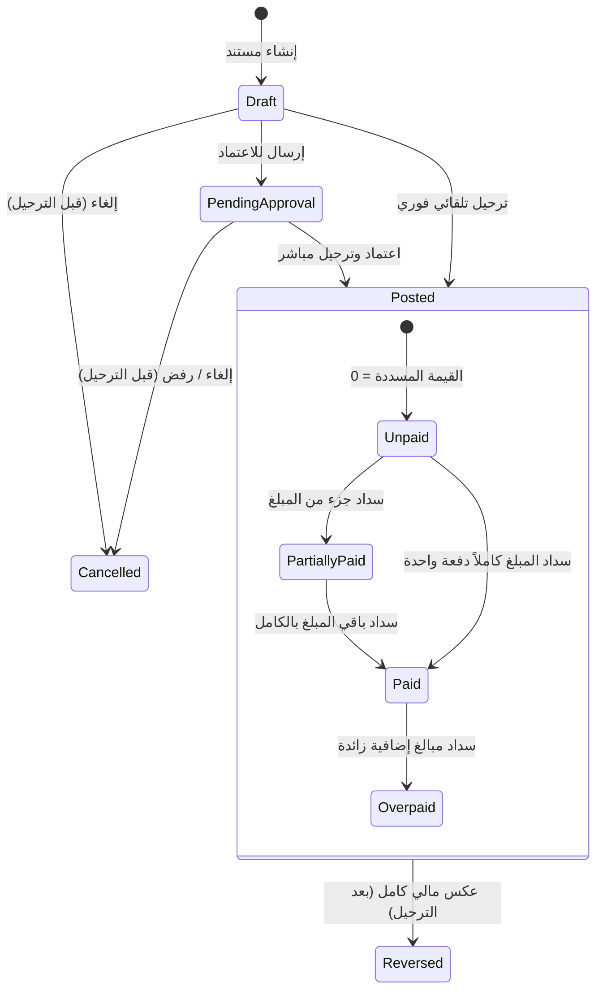

# 📖 دليل سيناريوهات التشغيل وسلوك النظام المالي (Business Workflow Handbook)

---

## 📌 1. المبادئ والمفاهيم التشغيلية الحاكمة (Operational Principles)

يمثل هذا الدليل المرجع التشغيلي الرسمي لجميع سيناريوهات الأعمال في HWNix ERP. تصف هذه الوثيقة **سلوك النظام الفعلي** ونتائج العمليات من منظور تجاري وتشغيلي، دون إدراج تفاصيل تقنية أو محاسبية للقيود.

---

### 1.1 الفصل بين حالة المستند وحالة السداد (Document Status vs. Payment Status)

لضمان الدقة التشغيلية ومنع تداخل الحالات، يفصل النظام بالكامل بين حالتين مستقلتين لكل مستند مالي (كالفواتير والاشتراكات والأقساط):

#### أولاً: حالة المستند (Document Status)
تعبّر عن **دورة حياة المستند وقانونيته** وصلاحية تعديله:
* **مسودة (Draft):** المستند قيد الإعداد. يمكن تعديل الأسعار والكميات والمستفيدين أو حذفه بالكامل. لا يترتب عليه أي أثر مالي أو مخزني.
* **قيد المراجعة (Pending Approval):** تم إرسال المستند للمراجعة والتدقيق الإداري. يُصبح غير قابل للتعديل مؤقتاً بانتظار قرار المشرف.
* **مرحّل (Posted):** تم اعتماد المستند وتثبيت أثره المالي والمخزني في النظام. **يصبح المستند للقراءة فقط ويُمنع تعديله أو حذفه نهائياً.**
* **ملغي (Cancelled):** مستند تم إلغاؤه **قبل مرحلة الترحيل** (وهو في حالة Draft أو Pending Approval). لا يترتب عليه أي أثر مالي.
* **معكوس (Reversed):** مستند تم ترحيله مسبقاً ماليًا (`Posted`) ثم تم إبطال أثره بالكامل ماليًا ومخزنيًا بإنشاء مستند عكسي تسووي مرتبط به. يبقى المستند الأصلي بالدفاتر لأغراض الرقابة وتتحول حالته التشغيلية إلى `Reversed`.

#### ثانياً: حالة السداد (Payment Status)
تعبّر عن **الموقف المالي الفعلي للتحصيل أو الصرف** للمستند (لا تنطبق إلا بعد ترحيل المستند وتحوله إلى `Posted`):
* **غير مدفوع (Unpaid):** القيمة المسددة للمستند تساوي صفراً.
* **مدفوع جزئياً (Partially Paid):** القيمة المسددة أكبر من صفر وأقل من إجمالي قيمة المستند.
* **مدفوع بالكامل (Paid):** القيمة المسددة تساوي تماماً إجمالي قيمة المستند.
* **مدفوع بالزيادة (Overpaid):** القيمة المسددة تفوق إجمالي قيمة المستند، ويترتب على ذلك توليد فائض (Customer Credit) لصالح المستفيد.

---

### 1.2 مخطط انتقالات الحالات الموحد (State Transitions Diagram)

---

### 1.3 دورة الاعتماد والترحيل المباشر (Approval & Posting Flow)

تماشياً مع الأنظمة العالمية (ERP Enterprise Standards)، تم دمج حالتي `Approved` و `Posted` لتبسيط الإجراءات:
* يتم الانتقال مباشرة من حالة **Pending Approval** إلى **Posted** بمجرد نقر المدير على زر الاعتماد.
* بمجرد حدوث الانتقال، يُقفل المستند ماليًا ومخزنيًا ويُمنع أي تعديل يدوي عليه.

---

### 1.4 قاعدة الإلغاء والعكس الصارمة (Cancellation & Reversal Rules)

* **قبل الترحيل (Draft / Pending Approval):**
  * يُسمح بالإلغاء المباشر للمستند لتتحول حالته إلى `Cancelled`.
  * لا يتم توليد أي حركات عكسية أو تسويات؛ لأن المستند لم يؤثر ماليًا أو مخزنيًا من الأساس.
* **بعد الترحيل (Posted):**
  * **يُمنع الإلغاء تماماً.**
  * الطريقة الوحيدة لإبطال المستند هي استدعاء دالة **العكس (Reversal)**.
  * يتم توليد مستند عكسي مقترن (إشعار دائن/مدين أو إيصال تسوية عكسية) يُعادل تماماً الأثر المالي والمخزني للمستند الأصلي.
  * يتحول المستند الأصلي إلى حالة `Reversed` وتظل بياناته التاريخية محفوظة بالكامل لأغراض التدقيق (Audit Trail).

---

### 1.5 الصلاحيات العامة للتشغيل (Execution Permissions)

تخضع جميع عمليات النظام للتحقق من الصلاحيات التالتة:
* **صلاحيات الموظف (Staff Permissions):** إنشاء المستندات كمسودة، وإرسالها للمراجعة، وتسجيل المبيعات العادية.
* **صلاحيات المشرف/الإدارة (Supervisor/Manager):** اعتماد المستندات وترحيلها (`Posted`)، وتعديل الأرصدة الافتتاحية، وإجراء تسويات الخزن، وعكس العمليات المالية التاريخية.

---

### 1.6 الأحداث التشغيلية للمستندات (Logical Business Events)

يقوم النظام بإطلاق الأحداث التالية عند انتقال حالات المستندات لتحديث الإحصائيات وبوابات العملاء:
* `DocumentDrafted` / `DocumentPosted` / `DocumentReversed`
* `DocumentPaymentUpdated` (عند تغير حالة السداد من Unpaid إلى Partially Paid أو Paid)
* `StockAdjusted` (عند التأثير الفعلي على المخزون)

---

## 2. الكتالوج التفصيلي لسيناريوهات التشغيل (Scenarios Catalog)

---

### 2.1 فاتورة البيع (Sale Invoice)

#### 2.1.1 وصف العملية
توثيق عملية بيع منتجات لعميل، يترتب عليها فوريًا خصم كميات المخزون وتحديد المديونية أو استلام النقدية.

#### 2.1.2 شروط التنفيذ والتحقق (حالات الفشل التشغيلية)
تفشل العملية ويمنع الحفظ في الحالات التالية:
* عدم كفاية كمية أي صنف مدرج بالفاتورة في المخزن المحدد (يُمنع البيع بالسالب).
* اختيار سداد آجل (كلياً أو جزئياً) لعميل غير نشط أو لا يمتلك قدرة `track_receivable`.
* تجميد الخزنة المحددة للتحصيل النقدي الفوري.
* تاريخ الفاتورة يقع ضمن فترة مالية مغلقة.

#### 2.1.3 حالات المستند والسداد (Status Mapping)
* **حالة المستند:** تبدأ `Draft` ثم تتحول إلى `Posted` عند الترحيل. وفي حال التراجع تصبح `Reversed`.
* **حالة السداد:** تبدأ `Unpaid` وتنتقل إلى `Partially Paid` أو `Paid` أو `Overpaid` حسب المبالغ المحصلة.

#### 2.1.4 السيناريوهات التشغيلية
* **بيع نقدي بالكامل:** سداد المبلغ كاملاً فوراً. حالة المستند `Posted` وحالة السداد `Paid`. يزداد كاش الخزنة ويُخصم المخزن.
* **بيع آجل بالكامل:** مديونية كاملة. حالة المستند `Posted` وحالة السداد `Unpaid`. يرتفع رصيد العميل المدين ويُخصم المخزن.
* **بيع بدفع جزئي:** سداد جزء كاش والمتبقي دين. حالة المستند `Posted` وحالة السداد `Partially Paid`. يرتفع كاش الخزنة بالمدفوع، وذمة العميل بالباقي.
* **دفع زائد:** سداد أكبر من الإجمالي. حالة المستند `Posted` وحالة السداد `Overpaid`. يرحل الفائض كفائض تحصيل (Credit Balance) للعميل.
* **استخدام رصيد دائن سابق للعميل:** تسوية الفاتورة بخصم قيمتها من رصيد العميل المقدم دون حركة كاش جديدة.
* **مرتجع كامل:** إرجاع كافة المنتجات المبيعة. تتحول حالة المستند الأصلي إلى `Reversed` وتعود المنتجات للمخزن.
* **مرتجع جزئي:** إرجاع بعض الأصناف فقط. يظل المستند الأصلي `Posted` وتُنشأ حركة مرتجع فرعية تُخصم من الإجمالي العام والمسدد للفاتورة الأصلية.

#### 2.1.5 جدول التأثير التشغيلي الموحد

| الجزء | حالة البيع النقدي | حالة البيع الآجل | حالة العكس الكامل |
| :--- | :--- | :--- | :--- |
| **المستند (Invoice)** | `Posted` / `Paid` | `Posted` / `Unpaid` | `Reversed` |
| **المخزون** | ⬇️ خصم الكميات فوراً | ⬇️ خصم الكميات فوراً | ⬆️ إعادة الكميات للمخزن |
| **الخزن** | ⬆️ يزداد بقيمة الفاتورة | ➖ لا يتأثر | ⬇️ يقل بقيمة المردود نقداً |
| **ذمم العملاء** | ➖ لا تتأثر | ⬆️ يزداد بقيمة الآجل | ⬇️ يقل بقيمة الآجل المعكوس |
| **ذمم الموردين**| ➖ لا تتأثر | ➖ لا تتأثر | ➖ لا تتأثر |
| **الأرباح** | ⬆️ تزداد بقيمة ربح المبيعات | ⬆️ تزداد بقيمة ربح المبيعات | ⬇️ تنخفض بقيمة أرباح المرتجع|
| **الأقساط** | ➖ لا تتأثر | تُنشأ الأقساط إذا تم جدولتها | تُلغى الأقساط غير المدفوعة |
| **التقارير** | تحديث المبيعات والكاش | تحديث المبيعات وذمم العملاء| تحديث المردودات والتسويات |
| **سجل النشاط** | توثيق عملية البيع والتحصيل | توثيق البيع وإثبات المديونية| توثيق العكس والسبب والمستخدم |

#### 2.1.6 ماذا لا يحدث؟
* لا يتم تعديل حساب المورد أو ذمم الموردين.
* لا يتم تعديل أي خزنة غير المحددة للتحصيل.
* لا يمكن تعديل كمية أو سعر صنف بالفاتورة بعد ترحيلها.

#### 2.1.7 قواعد وشروط العكس (Reversal Rules)
* يتم بإنشاء إشعار دائن (Credit Note) مساوٍ لقيمة الفاتورة الأصلية ليعكس حركات المخزن والكاش والذمم بالكامل.

---

### 2.2 فاتورة الشراء (Purchase Invoice)

#### 2.2.1 وصف العملية
توريد أصناف مخزنية من مورد، ويترتب عليها زيادة المخزون فور الترحيل وتوثيق التكلفة.

#### 2.2.2 شروط التنفيذ والتحقق (حالات الفشل)
تفشل ويمنع الترحيل في حال:
* المورد غير نشط أو لا يمتلك قدرة `track_payable` (في الشراء الآجل).
* الخزنة المحددة للصرف رصيدها غير كافٍ.
* المخزن المحدد مغلق.

#### 2.2.3 حالات المستند والسداد
* **حالة المستند:** تبدأ `Draft` ثم تتحول إلى `Posted` عند الترحيل. وفي حال التراجع تصبح `Reversed`.
* **حالة السداد:** تبدأ `Unpaid` وتنتقل إلى `Partially Paid` أو `Paid` أو `Overpaid` حسب المبالغ المصروفة للمورد.

#### 2.2.4 السيناريوهات التشغيلية
* **شراء نقدي بالكامل:** صرف القيمة للمورد فوراً. حالة المستند `Posted` وحالة السداد `Paid`. يزداد المخزن ويقل كاش الخزنة.
* **شراء آجل بالكامل:** مديونية للمورد. حالة المستند `Posted` وحالة السداد `Unpaid`. يزداد المخزن ويزداد رصيد المورد الدائن.
* **شراء جزئي:** صرف جزء كاش والباقي آجل. حالة المستند `Posted` وحالة السداد `Partially Paid`.

#### 2.2.5 جدول التأثير التشغيلي الموحد

| الجزء | حالة الشراء النقدي | حالة الشراء الآجل | حالة العكس الكامل |
| :--- | :--- | :--- | :--- |
| **المستند (Invoice)** | `Posted` / `Paid` | `Posted` / `Unpaid` | `Reversed` |
| **المخزون** | ⬆️ زيادة كميات الأصناف | ⬆️ زيادة كميات الأصناف | ⬇️ خصم الكميات من المخزن |
| **الخزن** | ⬇️ يقل بقيمة الصرف | ➖ لا يتأثر | ⬆️ يزداد بقيمة المبلغ المسترد |
| **ذمم العملاء** | ➖ لا تتأثر | ➖ لا تتأثر | ➖ لا تتأثر |
| **ذمم الموردين**| ➖ لا تتأثر | ⬆️ يزداد رصيد المورد الدائن | ⬇️ يقل رصيد المورد بقيمة العكس|
| **الأرباح** | ➖ لا تتأثر مباشرة | ➖ لا تتأثر مباشرة | ➖ لا تتأثر مباشرة |

#### 2.2.6 ماذا لا يحدث؟
* لا يتم تعديل ذمة أي عميل.
* لا يسمح بسحب مبالغ تتجاوز رصيد الخزينة المحددة.

#### 2.2.7 قواعد وشروط العكس (Reversal Rules)
* يتم بإنشاء إشعار مدين (Debit Note) ويُشترط للعكس توفر كمية المنتجات بالمخزن لإخراجها (يُمنع العكس إذا تم تصريف البضاعة وأصبح رصيدها صفراً).

---

### 2.3 مرتجع البيع (Sale Return)

#### 2.3.1 وصف العملية
إرجاع العميل لمنتجات اشتراها بموجب فاتورة أصلية مسجلة. يترتب عليها إدخال المنتجات للمخزن ورد قيمتها للعميل.

#### 2.3.2 شروط التنفيذ والتحقق
تفشل في حال:
* عدم تحديد فاتورة بيع أصلية مرتبطة بالمرتجع.
* تجاوز كمية المرتجع للكمية المباعة فعلياً.
* عدم توفر رصيد بالخزينة لرد المال (في المرتجع النقدي).

#### 2.3.3 الأثر المالي والتشغيلي
* **المرتجع النقدي:** حالة المستند `Posted` وحالة السداد `Paid`. يقل كاش الخزنة وتزداد الأصناف بالمخزن.
* **المرتجع الآجل:** حالة المستند `Posted` وحالة السداد `Paid` (حيث تم تسوية المرتجع لخفض ذمة العميل دون كاش).

#### 2.3.4 جدول التأثير التشغيلي الموحد

| الجزء | حالة المرتجع النقدي | حالة المرتجع الآجل |
| :--- | :--- | :--- |
| **المستند (Return)** | `Posted` / `Paid` | `Posted` / `Paid` |
| **المخزون** | ⬆️ زيادة كميات الأصناف بالمخزن | ⬆️ زيادة كميات الأصناف بالمخزن |
| **الخزن** | ⬇️ يقل بقيمة المبلغ المردود | ➖ لا يتأثر |
| **ذمم العملاء** | ➖ لا تتأثر | ⬇️ يقل رصيد العميل المدين |
| **الأرباح** | ⬇️ تقل بمقدار ربح الأصناف المرجعة | ⬇️ تقل بمقدار ربح الأصناف المرجعة |

---

### 2.4 مرتجع الشراء (Purchase Return)

#### 2.4.1 وصف العملية
إعادة أصناف للمورد بموجب فاتورة شراء أصلية.

#### 2.4.2 شروط التنفيذ والتحقق
تفشل في حال:
* عدم وجود فاتورة شراء أصلية مرتبطة.
* تجاوز الكمية المرتجعة للكمية الموردة فعلياً.
* عدم توفر الأصناف في المخزن المحدد (تم صرفها أو بيعها).

#### 2.4.3 الأثر المالي والتشغيلي
* **المرتجع النقدي:** استلام الكاش من المورد. حالة المستند `Posted` وحالة السداد `Paid` (يزداد كاش الخزينة ويقل المخزن).
* **المرتجع الآجل:** خفض مديونية المورد الدائنة (حيث يقل رصيده الدائن المستحق).

---

### 2.5 فاتورة الخدمات (Service Invoice)

#### 2.5.1 وصف العملية
بيع أو شراء خدمات (غير مخزنية) كالصيانة والاستشارات.

#### 2.5.2 شروط التنفيذ والتحقق
تفشل في حال:
* العميل أو المورد غير نشط.
* الخزنة المحددة للصرف أو التحصيل غير صالحة أو مغلقة.

#### 2.5.3 الأثر التشغيلي
* **المخزون:** لا يتأثر نهائياً (لا توجد قيود كميات أو تكلفة مبيعات).
* **الأرباح:** تزداد مباشرة بكامل قيمة الخدمة الصافية (عند البيع).

---

### 2.6 إنشاء خطط الأقساط (Installment Plan Creation)

#### 2.6.1 وصف العملية
جدولة القيمة الآجلة المتبقية لفاتورة عميل على دفعات فرعية بتواريخ محددة.

#### 2.6.2 شروط التنفيذ والتحقق
تفشل في حال:
* عدم تطابق مجموع مبالغ الأقساط المقترحة مع القيمة الآجلة المتبقية للفاتورة.
* العميل لا يمتلك قدرة `track_receivable`.

#### 2.6.3 الأثر التشغيلي
* **الخزن والذمم ماليًا:** لا تتأثر لحظة الإنشاء (الجدولة تشغيلية فقط والمديونية مثبتة بالفاتورة).
* **الأقساط:** تُنشأ سجلات الأقساط الفرعية بحالة `unpaid` وتواريخ استحقاقها وقيمها.

---

### 2.7 سداد الأقساط (Installment Payments)

#### 2.7.1 وصف العملية
تحصيل المبالغ المستحقة على العميل بموجب الأقساط المجدولة مسبقاً.

#### 2.7.2 شروط التنفيذ والتحقق
تفشل في حال:
* القسط بحالة `paid` بالفعل (ممنوع التحصيل المزدوج لنفس القسط).
* تجميد الخزنة المحددة لاستلام المال.

#### 2.7.3 السيناريوهات التشغيلية
* **سداد قسط بالكامل:** تحصيل قيمة القسط بدقة وتحوله لحالة `paid`.
* **سداد جزئي لقسط:** تحصيل مبلغ أقل من قيمة القسط وتحوله لـ `partially_paid`.
* **سداد مجمع لأقساط:** سداد مبلغ يغطي أكثر من قسط ويوزعه النظام بالتسلسل التاريخي (من الأقدم للأحدث).
* **سداد زائد عن الخطة:** سداد يفوق إجمالي مبالغ الأقساط المتبقية، ويستوفي الخطة كاملة ويرحل الباقي كفائض (Customer Credit).

#### 2.7.4 جدول التأثير التشغيلي الموحد

| الجزء | ماذا يحدث عند السداد الكامل | ماذا يحدث عند السداد الجزئي |
| :--- | :--- | :--- |
| **الأقساط** | تتحول حالة القسط إلى `paid`. | تتحول حالة القسط إلى `partially_paid`. |
| **الفاتورة** | يرتفع المدفوع التراكمي للفاتورة المرتبطة. | يرتفع المدفوع التراكمي للفاتورة المرتبطة بالجزئي. |
| **الخزن** | يزداد رصيد الخزينة بالكامل. | يزداد رصيد الخزينة بقيمة المبلغ المحصل جزئياً. |
| **ذمم العملاء** | ينخفض رصيد العميل المدين. | ينخفض رصيد العميل المدين بقيمة المحصل جزئياً. |

---

### 2.8 المدفوعات المستقلة (Independent Payments)

#### 2.8.1 وصف العملية
عمليات دفع أو تحصيل كاش تتم مباشرة مع العميل أو المورد دون ربطها بفاتورة معينة لحظة الدفع (تحت الحساب).

#### 2.8.2 شروط التنفيذ والتحقق
تفشل في حال:
* العميل أو المورد غير نشط أو لا يمتلك علاقة مالية.
* الخزنة المحددة غير نشطة أو لا تحتوي على كاش كافٍ (في حال الصرف للمورد).

#### 2.8.3 الأثر التشغيلي
* **الخزن:** يزداد كاش الخزينة (تحصيل عميل) أو يقل (سداد مورد).
* **الذمم:** ينخفض رصيد ذمة العميل المدين، أو ينخفض رصيد المورد الدائن.

---

### 2.9 المصروفات (Expenses)

#### 2.9.1 وصف العملية
صرف مبالغ مالية مقابل تكاليف تشغيلية (إيجارات، رواتب، كهرباء).

#### 2.9.2 شروط التنفيذ والتحقق
تفشل في حال:
* الخزنة المصدر لا تحتوي على رصيد كافٍ يغطي قيمة المصروف (يُمنع السحب بالسالب).

#### 2.9.3 الأثر التشغيلي
* **الخزن:** يقل رصيد الخزينة المصدر بقيمة المصروف.
* **الأرباح:** تنخفض الأرباح الصافية للشركة فوراً بقيمة المصروف بالكامل.

---

### 2.10 الإيرادات (Revenues)

#### 2.10.1 وصف العملية
تحصيل مبالغ مالية ناتجة عن أنشطة غير المبيعات المباشرة للمنتجات (مثل أرباح استثمار أو إيجار أصل للغير).

#### 2.10.2 الأثر التشغيلي
* **الخزن:** يزداد رصيد الخزينة بقيمة الإيراد.
* **الأرباح:** تزداد أرباح الشركة بقيمة الإيراد مباشرة.

---

### 2.11 التحويل بين الخزن (Fund Transfer)

#### 2.11.1 وصف العملية
تحويل مبالغ نقدية (كاش) من خزنة مصدر إلى خزنة مستهدفة تتبعان لنفس الشركة.

#### 2.11.2 شروط التنفيذ والتحقق
تفشل في حال:
* الخزنة المصدر أو المستهدفة غير نشطة أو تتبع شركة أخرى.
* عدم توفر رصيد كافٍ بالخزنة المصدر (يُمنع السحب بالسالب للتحويل).

#### 2.11.3 الأثر التشغيلي
* **الخزن:** يقل رصيد الخزنة المصدر بقيمة التحويل وتُسجل حركة `transfer_out` ويرتفع رصيد الخزنة المستهدفة بنفس القيمة وتُسجل حركة `transfer_in`.
* **السيولة الكلية:** ثابتة (لا يوجد زيادة أو نقص في إجمالي كاش الشركة).

---

### 2.12 الإيداع المباشر للعهدة (Custody Deposit)

#### 2.12.1 وصف العملية
تغذية وشحن رصيد الخزينة الشخصية للموظف (العهدة النقدية).

#### 2.12.2 الأثر التشغيلي
* **الخزن:** يزداد رصيد الخزينة الشخصية للموظف بقيمة الإيداع وتُسجل حركة `deposit`.

---

### 2.13 السحب المباشر من العهدة (Custody Withdrawal)

#### 2.13.1 وصف العملية
سحب أو تصفية مبالغ من العهدة النقدية الشخصية للموظف وإرجاعها للإدارة.

#### 2.13.2 شروط التنفيذ والتحقق
تفشل في حال:
* رصيد الخزينة الشخصية للموظف غير كافٍ لتغطية السحب.

#### 2.13.3 الأثر التشغيلي
* **الخزن:** ينخفض رصيد الخزينة الشخصية للموظف بقيمة السحب وتُسجل حركة `withdraw`.

---

### 2.14 تأسيس الأرصدة الافتتاحية (Opening Balances)

#### 2.14.1 وصف العملية
تسجيل الأرصدة التأسيسية الأولى للخزن والعملاء والموردين لحظة بدء العمل بالنظام للمرة الأولى.

#### 2.14.2 الأثر التشغيلي
* **ذمم العملاء:** يثبت مديونية أصلية للعميل مدين.
* **ذمم الموردين:** يثبت مستحقات أصلية للمورد دائن.
* **الخزن:** يثبت رصيد الكاش الافتتاحي بالخزنة.

---

### 2.15 تعديل الأرصدة الافتتاحية (Opening Balances Modification)

#### 2.15.1 وصف العملية
تعديل رصيد افتتاح أولي تم إدخاله بالخطأ لتصحيحه دون المساس بالسلامة المالية التاريخية.

#### 2.15.2 شروط التنفيذ والتحقق
تفشل في حال:
* عدم امتلاك المستخدم صلاحية إدارة الأرصدة الافتتاحية (`balances.opening.manage`).

#### 2.15.3 الأثر التشغيلي
* يحسب النظام الفرق بين الرصيد القديم والجديد، ويقوم بتوليد حركة تسوية/عكسية بالفرق تلقائياً لتعديل حساب العميل أو المورد أو الخزينة، ولا يقوم بالتعديل المباشر على القيود التاريخية الأولى لحفظ الـ Audit Trail.

---

### 2.16 تسوية الخزن وجرد الصناديق (Cashbox Reconciliation)

#### 2.16.1 وصف العملية
مطابقة الرصيد الدفتري المسجل في النظام مع الكاش الفعلي الموجود بالصندوق وإثبات الفوارق (عجز أو زيادة).

#### 2.16.2 شروط التنفيذ والتحقق
تفشل في حال:
* عدم مطابقة تواريخ الجرد أو إدخال قيم فارغة.

#### 2.16.3 الأثر التشغيلي عند الاعتماد
* **حالة العجز (الفعلي أقل من الدفتري):** يتم خصم الفارق من الخزينة ليتطابق مع الواقع، وتسجيل الفارق كخسارة تشغيلية (تخفيض الأرباح).
* **حالة الزيادة (الفعلي أكبر من الدفتري):** يتم إيداع الفارق بالخزينة وتسجيل الفارق كإيراد تشغيلي (زيادة الأرباح).

---

### 2.17 عكس العمليات المالية (Operation Reversal)

#### 2.17.1 وصف العملية
عكس الأثر المالي الكامل لمعاملة مسجلة مسبقاً ماليًا عبر المحرك المالي لضمان تتبع التدقيق.

#### 2.17.2 شروط التنفيذ والتحقق
تفشل في حال:
* العملية تم عكسها مسبقاً بالفعل.
* عدم امتلاك صلاحية العكس الإداري (`operations.reverse`).

#### 2.17.3 الأثر التشغيلي
* توليد حركات وأرصدة مضادة بالكامل ومعاكسة للأرصدة الأصلية تحت معرّف عملية عكسية جديدة وإرجاع الأرصدة والكميات لما كانت عليه قبل العملية.

---

### 2.18 إلغاء المعاملات (Cancellation)

#### 2.18.1 وصف العملية
إلغاء المعاملات التشغيلية المعتمدة والتراجع عنها ماليًا ومخزنيًا.

#### 2.18.2 الأثر التشغيلي
* الإلغاء للمستندات المعتمدة والمرحّلة يترتب عليه تلقائياً استدعاء عملية العكس المالي بالكامل (`Reversal`) لضمان سلامة الدفاتر وتغيير حالة المستند إلى `Cancelled` أو `Reversed` ويُمنع إجراء أي حركات لاحقة عليه.

---

### 2.19 الاشتراكات وتجديدها (Subscriptions Renewal)

#### 2.19.1 وصف العملية
تجديد اشتراكات العملاء في باقات الخدمات دورياً وما يترتب عليه من استلام مقبوضات نقدية بالخزينة.

#### 2.19.2 الأثر التشغيلي
* **الخزن:** يزداد رصيد الخزينة بقيمة الاشتراك المحصل وتُسجل حركة مقبوضات `deposit`.
* **الأرباح:** تزداد أرباح الشركة بقيمة التجديد.

---

## 📊 3. مصفوفة التأثيرات الشاملة للعمليات (Global Impact Matrix)

يوضح الجدول التالي الأثر الكلي والشامل لكل حركة تشغيلية في النظام فور اعتمادها وترحيلها:

| الحركة التشغيلية | أثر المخزون | أثر الخزن | أثر ذمم العملاء | أثر ذمم الموردين | أثر الأرباح | أثر الأقساط | أثر الإشعارات | الحدث المولد |
| :--- | :--- | :--- | :--- | :--- | :--- | :--- | :--- | :--- |
| **فاتورة بيع نقدية** | ⬇️ خفض | ⬆️ زيادة | ➖ ثابت | ➖ ثابت | ⬆️ زيادة | ➖ ثابت | إرسال قبض | `InvoicePosted` |
| **فاتورة بيع آجلة** | ⬇️ خفض | ➖ ثابت | ⬆️ زيادة | ➖ ثابت | ⬆️ زيادة | ➖ ثابت | إرسال مديونية| `InvoicePosted` |
| **فاتورة بيع جزئية**| ⬇️ خفض | ⬆️ زيادة | ⬆️ زيادة | ➖ ثابت | ⬆️ زيادة | ➖ ثابت | إرسال قبض | `InvoicePosted` |
| **فاتورة بيع بالتقسيط**| ⬇️ خفض | ➖ ثابت | ⬆️ زيادة | ➖ ثابت | ⬆️ زيادة | ⬆️ إنشاء أقساط | إرسال جدولة | `InvoicePosted` |
| **فاتورة شراء نقدية**| ⬆️ زيادة | ⬇️ خفض | ➖ ثابت | ➖ ثابت | ➖ ثابت | ➖ ثابت | إرسال توريد | `InvoicePosted` |
| **فاتورة شراء آجلة**| ⬆️ زيادة | ➖ ثابت | ➖ ثابت | ⬆️ زيادة | ➖ ثابت | ➖ ثابت | إرسال توريد | `InvoicePosted` |
| **فاتورة خدمات مبيعات**| ➖ ثابت | ⬆️ زيادة | ➖ ثابت | ➖ ثابت | ⬆️ زيادة | ➖ ثابت | إرسال فاتورة | `InvoicePosted` |
| **مرتجع بيع نقدي** | ⬆️ زيادة | ⬇️ خفض | ➖ ثابت | ➖ ثابت | ⬇️ خفض | ➖ ثابت | إرسال صرف | `ReturnPosted` |
| **مرتجع بيع آجل** | ⬆️ زيادة | ➖ ثابت | ⬇️ خفض | ➖ ثابت | ⬇️ خفض | ➖ ثابت | إرسال تسوية | `ReturnPosted` |
| **مرتجع شراء نقدي** | ⬇️ خفض | ⬆️ زيادة | ➖ ثابت | ➖ ثابت | ➖ ثابت | ➖ ثابت | إرسال إضافة | `ReturnPosted` |
| **مرتجع شراء آجل** | ⬇️ خفض | ➖ ثابت | ➖ ثابت | ⬇️ خفض | ➖ ثابت | ➖ ثابت | إرسال تسوية | `ReturnPosted` |
| **سداد قسط** | ➖ ثابت | ⬆️ زيادة | ⬇️ خفض | ➖ ثابت | ➖ ثابت | 🔄 تحديث حالة | إرسال تحصيل | `InstallmentPaid`|
| **تحويل بين الخزن** | ➖ ثابت | 🔄 نقل | ➖ ثابت | ➖ ثابت | ➖ ثابت | ➖ ثابت | إرسال إشعار | `CashTransferred`|
| **إيداع عهدة موظف** | ➖ ثابت | ⬆️ زيادة | ➖ ثابت | ➖ ثابت | ➖ ثابت | ➖ ثابت | إرسال إيداع | `CustodyDeposited`|
| **سحب عهدة موظف** | ➖ ثابت | ⬇️ خفض | ➖ ثابت | ➖ ثابت | ➖ ثابت | ➖ ثابت | إرسال سحب | `CustodyWithdrawn`|
| **تسوية خزينة (عجز)**| ➖ ثابت | ⬇️ خفض | ➖ ثابت | ➖ ثابت | ⬇️ خفض | ➖ ثابت | إرسال تسوية | `Reconciled` |
| **تسوية خزينة (زيادة)**| ➖ ثابت | ⬆️ زيادة | ➖ ثابت | ➖ ثابت | ⬆️ زيادة | ➖ ثابت | إرسال تسوية | `Reconciled` |
| **المصروفات النقدية** | ➖ ثابت | ⬇️ خفض | ➖ ثابت | ➖ ثابت | ⬇️ خفض | ➖ ثابت | إرسال إشعار | `ExpensePosted` |
| **الإيرادات النقدية** | ➖ ثابت | ⬆️ زيادة | ➖ ثابت | ➖ ثابت | ⬆️ زيادة | ➖ ثابت | إرسال إشعار | `RevenuePosted` |
| **عكس عملية مالية** | 🔄 عكس | 🔄 عكس | 🔄 عكس | 🔄 عكس | 🔄 عكس | 🔄 عكس | إرسال تسوية | `OperationReversed`|
